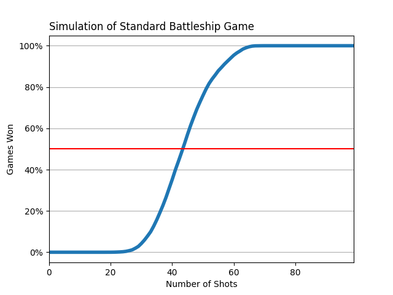

# Battleship

A Battleship Bot using Probability Density Functions written in Rust.

## Stats



## Usage

Import the crate with

```toml
battleship = { git = 'https://github.com/Jeimel/Battleship.git' }
```

To run a simulation use

```shell
git clone https://github.com/Jeimel/Battleship.git
python plot.py
```
